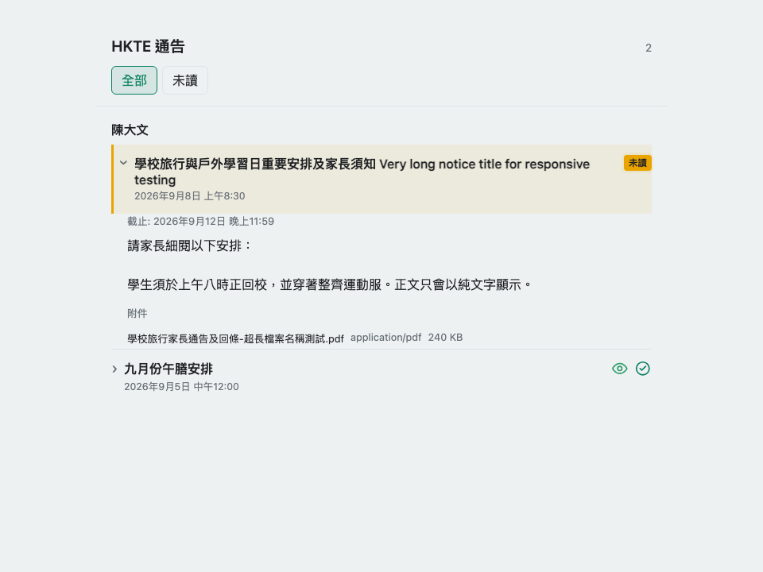

# HKTE Smart School Notices Card


Read-only Lovelace card for the [HKTE Smart School Home Assistant integration](https://github.com/wfchan/hass-hkte-smart-school).

## Card preview



The preview uses synthetic sample content and contains no student data.

## HACS installation

In HACS, add `https://github.com/wfchan/hass-hkte-smart-school-card` as a custom repository with category **Plugin**, install **HKTE Smart School Notices Card**, then add the generated resource when Home Assistant prompts you. The card requires integration version 0.3.x or newer.

## Dashboard card

With no `entities`, the card discovers all HKTE notice-content sensors. Explicit entities are useful when a dashboard should show only one student:

```yaml
type: custom:hkte-notices-card
title: HKTE 通告
entities:
  - sensor.student_notice_content
filter: all
limit: 20
days: 0
initially_expanded: latest
show_attachments: true
```

The card only reads Home Assistant entity state. It does not call HKTE, mark notices as read, send replies, or download attachment files. Attachments are shown as filename, MIME type and size metadata only. Notice bodies are rendered as plain text and embedded links or media are never loaded.

Each notice title row includes its issued date. Read notices use a green eye icon, and replied notices use a sign icon; these status icons stay aligned to the far right for quick scanning. Unread notices retain the orange `未讀` badge, a highlighted row style, and a short attention pulse (disabled when reduced motion is enabled).

## Configuration

`entities` is optional and accepts one or more `notice_content` sensor entity IDs. `filter` is `all` or `unread`; `limit` is 1-20; `days` limits results to notices issued within the most recent number of days (`0` means no date limit); `initially_expanded` controls the default view (`latest` expands the latest notice, `none` collapses the latest notice, and `all` expands all notices); and `show_attachments` controls metadata rows.

## Development

```bash
npm ci
npm run typecheck
npm test
npm run build
```

## License

MIT
